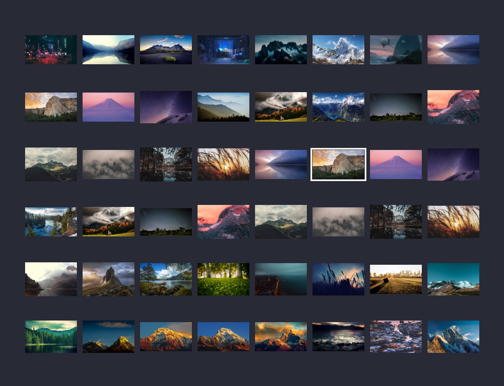

# Wallpapers

This is a small collection of cool wallpapers, mainly nature and landscapes
pics. I do no own any copyright, just found them here and there surfing around.




## Rename

With the intent of keeping the repo in order, I wrote a simple script that
renames every file inside it with a progresive number: just throw any picture
(of any format) in this directory and run

```
./pic-rename
```


## Wallogo

Wallpapers are cool, but wouldn't are they even cooler if you could stick a fancy
logo on top? Well then, use

```
./pic-wallogo <path/to/logo.png>
```

to create `./wallogo` containing all the wallpapers enhanced with the logo
specified (have a look inside `./logos`, there are some samples).


## Video-wallpapers

Inside the `./videos` directory there are a bunch of small videos usable as
wallpaper with the help of [this script](https://github.com/matteogiorgi/.dotfiles/blob/master/bin/bin/wallset). I've mapped the command inside my rc.conf
to speed things up together with the one to arrest the video-wallpaper.

```
map ev shell wallset --video %f
map eq shell wallset --quit
```

---

The `vid-rename` script inside `./videos` has the same purpose `./pic-rename`
has, with a plus: it convert any gif inside the direcory in an mp4 before rename
it appropriately. This is becouse on the web is much easier to find gifs than
small videos.
