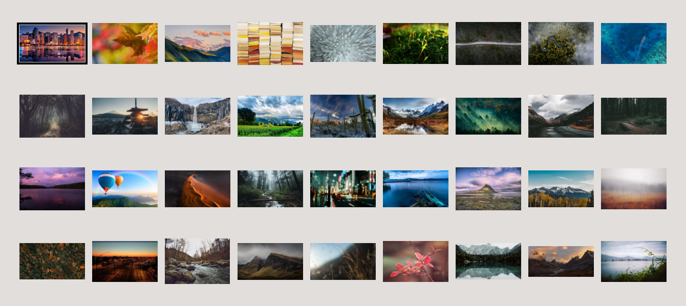

# Wallpapers

This is a small collection of cool wallpapers, mainly nature and landscapes
pics. I do no own any copyright, just found them here and there surfing around.




## Rename

With the intent of keeping the repo in order, I wrote a simple script that
renames every file inside it with a progresive number: just throw any picture
(of any format) inside the `pics` directory and run

```
./pic-rename
```


## Wallogo

Wallpapers are cool, but wouldn't are they even cooler if you could stick a fancy
logo on top? Well then, use

```
./pic-wallogo ./logo/<yourlogo>.png
```

to create `./wallogo` containing all the wallpapers enhanced with the logo
specified (have a look inside `./logos`, there are some samples).
